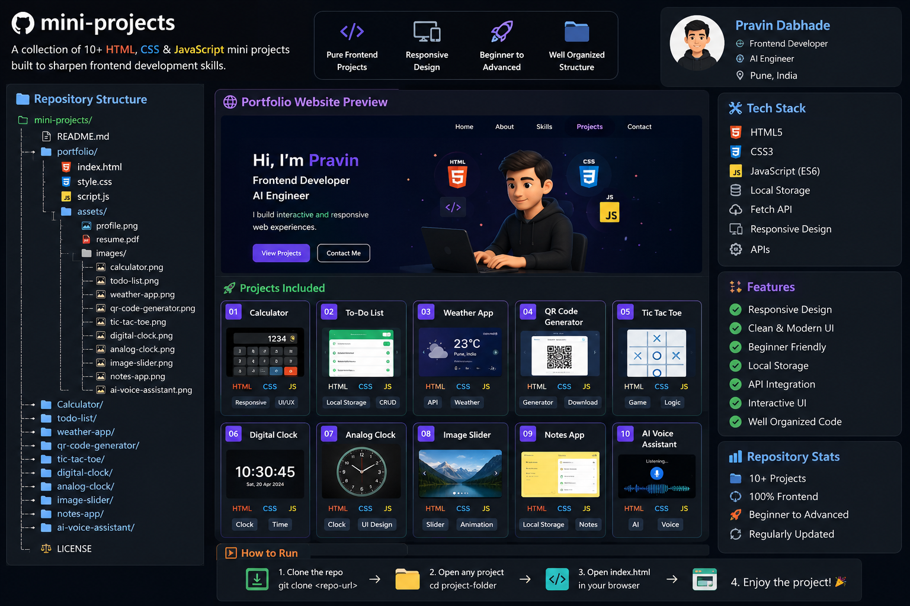

# 🚀 HTML, CSS & JavaScript Mini Projects

# 🚀 HTML, CSS & JavaScript Mini Projects

A collection of **10+ HTML, CSS & JavaScript** mini projects built to improve frontend development skills.

<p align="center">
  
</p>

---

## 📂 Projects

| No. | Project | Technologies | Live Demo | Source Code |
|:---:|---------|--------------|:---------:|:-----------:|
| 01 | Calculator | HTML, CSS, JavaScript | 🔗 Live | 📁 Code |
| 02 | To-Do List | HTML, CSS, JavaScript | 🔗 Live | 📁 Code |
| 03 | Weather App | HTML, CSS, JavaScript, API | 🔗 Live | 📁 Code |
| 04 | QR Code Generator | HTML, CSS, JavaScript | 🔗 Live | 📁 Code |
| 05 | Tic Tac Toe | HTML, CSS, JavaScript | 🔗 Live | 📁 Code |
| 06 | Digital Clock | HTML, CSS, JavaScript | 🔗 Live | 📁 Code |
| 07 | Analog Clock | HTML, CSS, JavaScript | 🔗 Live | 📁 Code |
| 08 | Image Slider | HTML, CSS, JavaScript | 🔗 Live | 📁 Code |
| 09 | Notes App | HTML, CSS, JavaScript | 🔗 Live | 📁 Code |
| 10 | AI Voice Assistant | HTML, CSS, JavaScript, Gemini API | 🔗 Live | 📁 Code |

---

## 🛠️ Technologies

- HTML5
- CSS3
- JavaScript (ES6)
- Responsive Design
- Local Storage
- Fetch API
- REST APIs

---

## 📁 Repository Structure

```text
mini-projects/
│
├── mini-project.png
├── README.md
├── Calculator/
├── todo-list/
├── weather-app/
├── qr-code-generator/
├── tic-tac-toe/
├── digital-clock/
├── analog-clock/
├── image-slider/
├── notes-app/
├── ai-voice-assistant/
└── portfolio/
```

---

## ⭐ Support

If you like this repository:

⭐ Star this repository

🍴 Fork this repository

📢 Share it with your friends

---

## 👨‍💻 Author

**Pravin Dabhade**

- GitHub: https://github.com/pravindabhade
- LinkedIn: *(Add your LinkedIn URL)*
- Portfolio: *(Add your Portfolio URL)*

---

<p align="center">
Made with ❤️ by <strong>Pravin Dabhade</strong>
</p>
